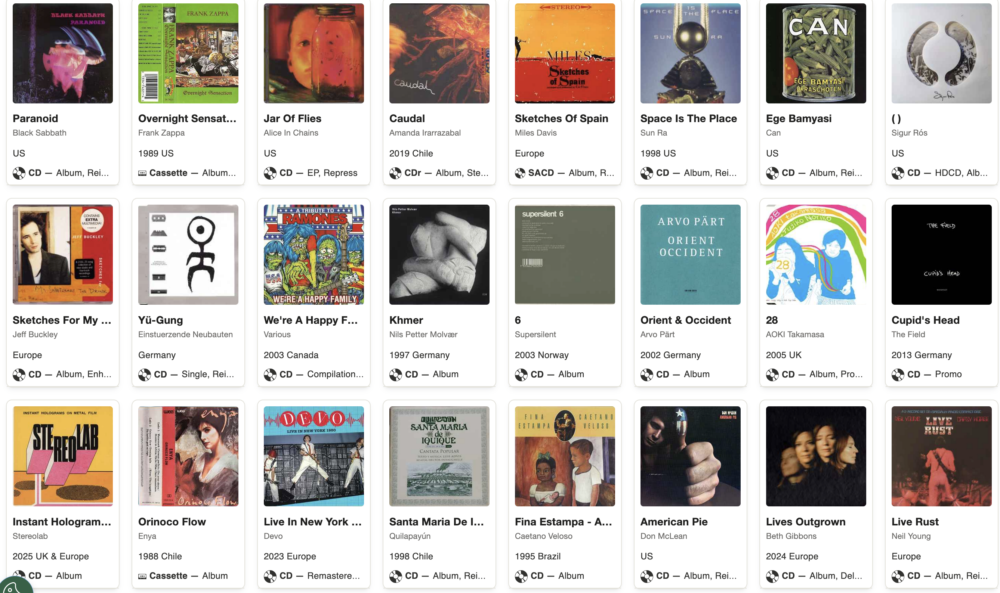

# Múltiples músicas x misaa.cc

Este pequeño archivo es una documentación de parte de las diversas músicas y sonidos a los que tengo acceso. En mi adolescencia, antes de la omnipresencia de las plataformas de streaming, mi colección musical consistía en música descubierta principalmente a través de last.fm, recomendados por amigues, o en descargas de blogs y sistemas p2p. Estos los estructuraba en carpetas por artista, álbum y canción. Con los años, uno de los discos duros donde almacenaba música se dañó, perdiendo la oportunidad de volver a la música que ya no recordaba, y mis hábitos se fueron mezclando con lo que iba ofreciendo de manera incesante el algoritmo. Eso me hizo perder la relación que guardaba con los discos que descargaba, etiquetaba y escuchaba cada día, primer gesto desde el cual producía relaciones afectivas con los álbumes. Incluso años después, era capaz de seguir recordando donde había encontrado el álbum, como me sentía la primera vez que lo oí, o con quienes estaba dialogando. Ahora, busco reconstruir esa actitud activa con la música que oigo, por medio de un uso más consciente de las playlist de los servicios de streaming, la que se suma a una pequeña colección de música física que intento ampliar constantemente.

## 📅 Playlists música descubierta 2026

Listas de reproducción mensuales con discos en rotación de cada periodo. Música de todas las épocas y géneros.

| Mes | Playlist Youtube | Tabla |
| --- | --- | --- |
| Julio | [2026-07](https://music.youtube.com/playlist?list=PLAJnUbi2Nx3Q) | ---  |
| Junio | [2026-06](https://music.youtube.com/playlist?list=PLYuJsrss8DN9dDFUriIUbCQdR_cu7cLVJ) | [2026-06.md](2026/2026-06.md)  |
| Mayo | [2026-05](https://music.youtube.com/playlist?list=PLYuJsrss8DN-zlTZhOBbahbFt0iQVdz_k&si=4eBtVbLzUghq4Hfi) | [2026-05.md](2026/2026-05.md) |
| Abril | [2026-04](https://music.youtube.com/playlist?list=PLYuJsrss8DN8dI53TsCLO2kr7j0qG6cDD&si=5cYTljNNYdiQo8aG) | [2026-04.md](2026/2026-04.md) |
| Marzo | [2026-03](https://music.youtube.com/playlist?list=PLYuJsrss8DN_k1YXDMFmPMJiMojiOZjAY&si=_E4Q4UKJ5QZEmlj5) | [2026-03.md](2026/2026-03.md) |
| Febrero | [2026-02](https://music.youtube.com/playlist?list=PLYuJsrss8DN_1g7HNw3F4aNSVR7LoNuNY&si=UDHtWfMM0lrduX0_) | [2026-02.md](2026/2026-02.md) |
| Enero | [2026-01](https://music.youtube.com/playlist?list=PLYuJsrss8DN8Jauq9DOP6PRsozP1cHBWi&si=DLhcSwXwbiktk9dA) | [2026-01.md](2026/2026-01.md) |

## 🎚️ Otras playlists

| Título | Enlace |
| --- | --- |
| Discos favoritos de la historia | [discos que discos](https://music.youtube.com/playlist?list=PLYuJsrss8DN-Tn2OlqzzZ3LGBVGdwZVqJ&si=mi8nwe1oYaRE97Jz) |
| *Ambient* estricto | [ambient para toda la familia](https://music.youtube.com/playlist?list=PLYuJsrss8DN-Df8ZHysigX7tUk4w2oQ_N&si=Nx45qn76S9OlB1uB) |
| Cosas que les di like alguna vez | [laiks](https://music.youtube.com/playlist?list=PLYuJsrss8DN9sUkY_Tzp0GHc0LtczxGKI&si=56b5OeZU_Xs8D0-j) |
| Música con secuenciadores | [Sequlentas](https://music.youtube.com/playlist?list=PLYuJsrss8DN_QGdA1Bobrr0cKzn_sSPVH&si=U9KlVZPcKMet_FKb) |
| Piezas sonoras producidas por mujeres | [Mujeres en la línea de fuga](https://music.youtube.com/playlist?list=PLYuJsrss8DN8fUQ3MzqiokW7XcXP770mk&si=yUD_KswQcMfKsphU) |
| Covers | [Covvvers](https://music.youtube.com/playlist?list=PLYuJsrss8DN95k30V0zyX3aOfkXKK4LY9&si=O7hwWXaPfuLeJ4Ml) |
| Antigua lista de discos pendientes por escuchar | [pendientes](https://music.youtube.com/playlist?list=PLYuJsrss8DN9PpedQWUCVgn7kh26Hxarc&si=rD3gFnqNMvXlm9da) |
| Música japonesa | [.jpn 🇯🇵](https://music.youtube.com/playlist?list=PLYuJsrss8DN9LdaAjBLvjKLjWm3ZzyKz6&si=KWE8HQXguSofyVYd) |

## 📀 Colección física

| Tipo | Enlace |
| --- | --- |
| Colección (cds, cassettes, formatos raros) | [matilov - Colección](https://www.discogs.com/es/user/matilov/collection) |
| Lista de deseos | [Discogs Wantlist](https://www.discogs.com/wantlist?user=matilov) |

## 📣 Donde encontrar música nueva

| Tipo | Descripción | Enlace |
| --- | --- | --- |
| Revista | Música electrónica nueva | [First Floor \| Shawn Reynaldo \| Substack](https://firstfloor.substack.com/) |
| Instagram | Música experimental, de todas las épocas | [ida b. (@slyida.b) • Instagram profile](https://www.instagram.com/slyida.b/) |
| Instagram | Noise | [Outside Noise (@outsidenoise444) • Instagram profile](https://www.instagram.com/outsidenoise444/) |
| Instagram | Comenta discos recientes | [Nick Fry (@nicksmusictaste) • Instagram profile](https://www.instagram.com/nicksmusictaste/) |
| Instagram |   Principalmente música japonesa  | [Teshisfinehour](https://www.instagram.com/teshisfinehour/)|
| Instagram | Todo tipo de jazz | [the.jazz.corner](https://www.instagram.com/the.jazz.corner/)|
| Blog | Música experimental, ambient | [The Attic Magazine](https://theatticmag.com)|
| Tienda | Tienda online de música experimental | [SoundOhm](https://www.soundohm.com/) |
| Radio | Radio online de música experimental | [dfm.nu](https://dfm.nu/) | 

### 📼 Labels

| Sello | Ubicación | Año | Estilos | Enlace |
|-------|-----------|------|---------|--------|
| **Pueblo Nuevo** | Santiago, Chile | 2005 | Electrónica, experimental, ambient, noise, electroacústica | <https://pueblonuevo.cl/> |
| **Grieta Label** | Santiago, Chile | 2024 | Música + literatura, experimental | <https://grietalabel.myshopify.com/> |
| **Archivo Veintidós** | Santiago, Chile | 2019 | Experimental, dark ambient, arte sonoro, paisajismo sonoro | <http://archivoveintidos.org/> |
| **Buh Records** | Lima, Perú | 2004 | Experimental, noise, avant-garde, folk experimental | <https://buhrecords.bandcamp.com/> |
| **Sub Rosa Label** | Bruselas, Bélgica | 1989 | Drone, noise, concrète, electrónica, experimental, ritual | <https://subrosalabel.bandcamp.com/> |
| **Constellation Records** | Montreal, Canadá | 1997 | Experimental, post-rock, ambient, experimental de género mixto | <https://constellation.bandcamp.com/> |
| **Medio Oriente** | Santiago, Chile | 2016 | Electrónica experimental, club experimental | <https://mediooriente.bandcamp.com/> |
| **Akuphone** | Francia | 2015 | World music, folk, música ritual, música experimental | <https://akuphone.bandcamp.com/> |
| **DiN Records** | UK | 1999 | Ambient, electrónica, síntesis analógica, Berlin School | <https://dinrecords.bandcamp.com/> |
| **Serein Label** | Gales, UK | 2005 | Ambient, experimental, dark ambient | <https://sereinlabel.bandcamp.com/> |
| **Inner Islands** | Seattle, Washington | 2010 | Ambient, devocional, experimental minimalista | <https://innerislands.bandcamp.com/> |

### 💽 Álbumes publicados bajo "misaa"

| Año | Álbum | Sello | Enlace |
|---  | ---   | ---   | ---    |  
| 2019 | minor planets | Archivo Veintidós | <http://archivoveintidos.org/catalogo/a22002.html> |
| 2020 | minoritario | Pueblo Nuevo | <https://pueblonuevo.cl/catalogo/minoritario/>| 
| 2021 | tres reconstituciones y un documental sonoro | Sello Medio Oriente | <https://mediooriente.bandcamp.com/album/tres-reconstituciones-y-un-documental-sonoro> |

---

[https://misaa.cc](https://misaa.cc)
